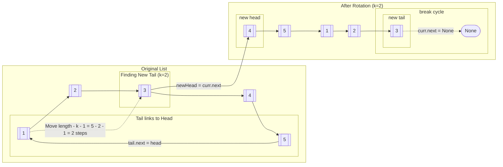

# [61. Rotate List ](61_Rotate_List.py)
Example = `head = [1, 2, 3, 4, 5]` and `k = 2`

1. Count the length of the Linked List
   + This will include keeping track of the tail
2. Traverse through the Linked List from the begining (`curr = head`) until `length - (k % length) - 1`
   + Keep in mind that `- 1` is included in the range to account for the `head` 
   + This will help locate the new tail
3. Link the old `tail` back to `head` (making it circular Linked List)
4. Create a copy of the new head (`newHead = curr.next)
5. Update your tail (`curr.next = None`)
   + Keep in mid that you must make a copy of new head FIRST
6. Return the start of your Linked List 

